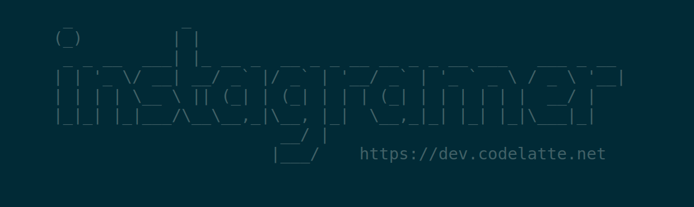
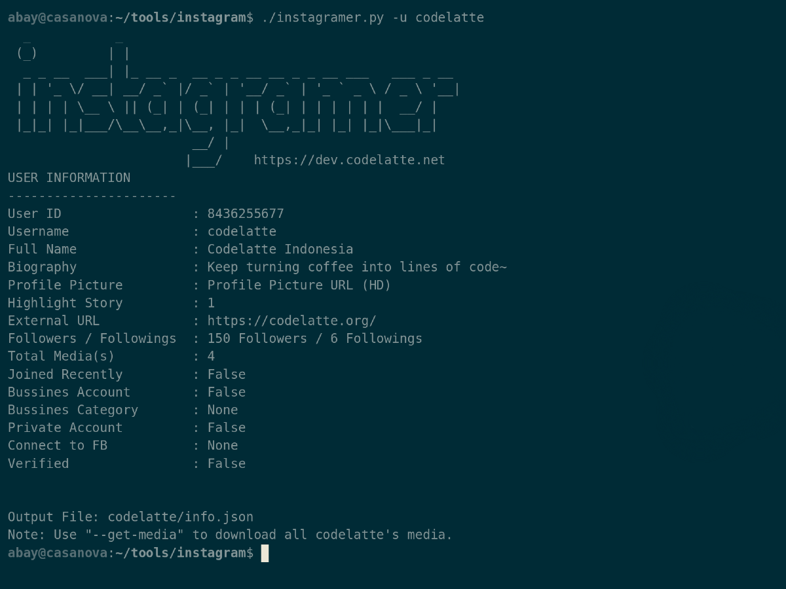

## Instagramer: Instagram User's Media Downloader


### Installation
Instagramer requires Python 3+ to run.
You don't need to do anything but cloning this repository.
```
git clone https://github.com/abaykan/Instagramer.git instagramer
cd instagramer
python3 instagramer.py or ./instagramer.py
```

### Usage
```
# Get user's information
python3 instagramer.py -u {username}

# Download all user's media
python3 instagramer.py -u {username} --get-media
```

### Demo
It's better to follow the Instagram account @codelatte to brighten your day.
[](https://asciinema.org/a/330625)

### Development
Want to contribute? Great! You know what to do.